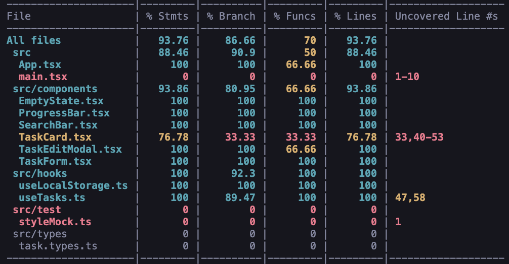

# TaskFlow

O **TaskFlow** é um gerenciador de tarefas pessoal que une uma interface moderna a uma estrutura de código pensada na confiabilidade do usuário. Mais do que uma lista de tarefas, este projeto foi meu laboratório para aplicar boas práticas de QA (Quality Assurance).



🔗 **[Acesse a aplicação ao vivo aqui](https://taskflow-three-zeta.vercel.app/)**

---

## 🧪 Foco em Estabilidade e Qualidade

Durante o desenvolvimento, implementei:

- **22 testes automatizados** cobrindo os principais fluxos da aplicação
- **Documentação estruturada** incluindo casos de teste e regras de negócio
- **Cobertura de código** monitorada com relatórios do Vitest

📁 Documentação disponível:
- [Regras de Negócio (PRD)](./docs/PRD_TaskFlow.md)
- [Casos de Teste](./docs/Casos_de_Teste_TaskFlow.md)

---

## ✨ Funcionalidades

**Gestão de Tarefas**
- Criar, editar e deletar tarefas com título, descrição e prioridade
- Sistema de prioridades (Alta, Média, Baixa)
- Barra de progresso visual

**Experiência de Uso**
- Busca em tempo real por título ou descrição
- Filtros por status (Todas, Pendentes, Concluídas)
- Interface em dark mode
- Persistência automática no navegador

---

## 🤝 Parceria com IA

Este projeto contou com o apoio estratégico de IAs (Claude/Gemini), que atuaram como mentores durante o aprendizado. Usei IA para:

- Refinamento de UX/UI: Evolução do layout para um padrão mais profissional e moderno.
- Resolução de Problemas: Auxílio no debug de CSS complexo e configurações de ambiente de teste.
- Aprendizado Acelerado: Discussão de padrões de projeto e melhores práticas de código.

A colaboração com IA acelerou o aprendizado, mas cada decisão de implementação foi minha - a IA serviu como guia, não como substituta do processo de aprendizado.

---

## 🛠️ Tecnologias

**Core**
- React 18 + TypeScript
- Vite (build tool)

**UI/UX**
- Lucide React (ícones)
- React Hot Toast (notificações)

**Testes**
- Vitest (test runner)
- React Testing Library (testes de componentes)

---

## 🚀 Rodando o Projeto
```bash
# Instale as dependências
npm install

# Inicie o projeto
npm run dev

# Rode os testes
npm test

# Ver Relatório de Cobertura
npm run test:coverage
